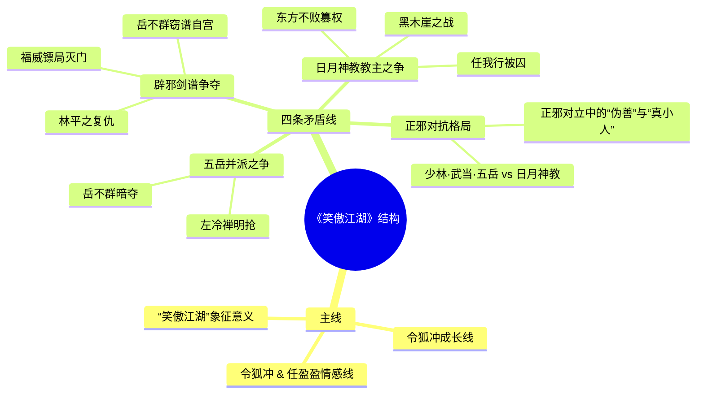
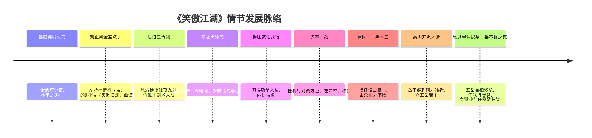
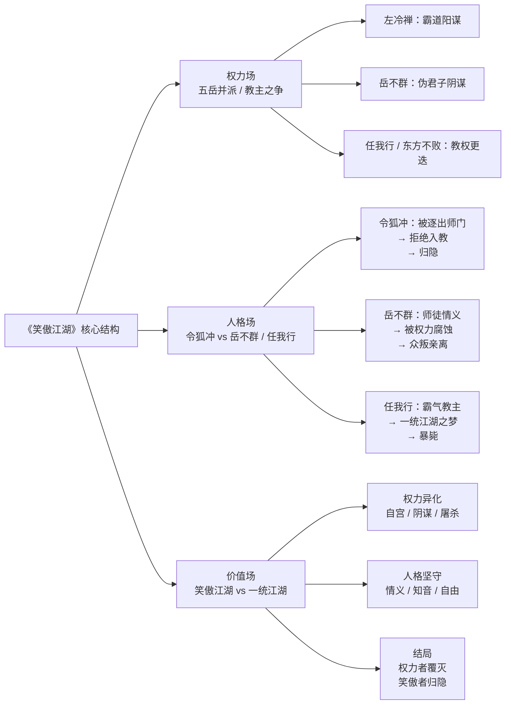

《笑傲江湖》在结构上是一部“多线并进、权力与人性交织”的武侠政治寓言。  
小说以令狐冲的个人命运为主线，串联起五岳剑派内部的并派之争、辟邪剑谱的争夺、日月神教内部的教主之争，以及“正邪两道”的对抗，四条矛盾线层层缠绕，把江湖写成了一张权力与欲望的大网。
下面我分几次讲：  
这一次先讲整体架构、势力范围，下一次再细讲情节发展和矛盾冲突。
---
## 一、小说整体结构：一条主线 + 四条矛盾线
有研究文章把《笑傲江湖》的情节结构概括为“一个骨干、四个分支”：  
- 骨干：令狐冲、任盈盈能否从江湖争斗中全身而退，合奏《笑傲江湖》曲。  
- 四个分支：  
  1. 五岳剑派的合分之争（左冷禅、岳不群并派）  
  2. 辟邪剑谱的争夺（福威镖局灭门、林平之、岳不群）  
  3. 日月神教教主之争（任我行 vs 东方不败）  
  4. 五岳剑派与日月神教的“正邪之争”  
这四条线，彼此交织、互为因果，令狐冲在其中既是“被卷入者”，也是“破局者”。
可以用一个简单的结构图来帮你看清整体：

---
## 二、江湖势力范围与格局
### 1. 总体格局：三大板块 + 若配角
大致可以分成三大势力板块，加上一些边缘门派：
1. 正道“泰山北斗”：少林、武当  
2. 新兴联盟：五岳剑派（嵩山、华山、衡山、恒山、泰山）  
3. 魔道一极：日月神教及其附属势力  
4. 配角势力：青城派、丐帮、昆仑、峨眉等
#### （1）少林、武当：超然的“武林长老”
- 地位：天下武功出少林，武当与之并列，是江湖公认的“名门正派”领袖。  
- 实力：  
  - 少林僧众不下千人，方证大师武功与任我行、东方不败同属顶尖，达摩堂、戒律院高手众多。  
  - 武当稍显衰落，真武剑与《太极拳经》早年曾被日月神教盗走，后由任盈盈归还；冲虚道长太极剑虽高，但武当后继乏人。  
- 功能：  
  - 在江湖纷争中扮演“调停者”“秩序维护者”，但更多是幕后平衡，而非直接冲锋陷阵。  
  - 对五岳并派、魔教扩张都有强烈的危机感，暗中扶持令狐冲、牵制左冷禅与岳不群。
#### （2）五岳剑派：内部并派是全书核心矛盾之一
五岳剑派是泰山、衡山、华山、嵩山、恒山五派结成的同盟，以剑术为主，百年前为对抗“魔教”而结盟。
- 嵩山派  
  - 掌门左冷禅：五岳剑派盟主，野心最大，主张“五岳并派”，自任五岳派掌门，进而与少林、武当抗衡。  
  - 实力：在五岳中实力最强，有“十三太保”等高手，网罗大量旁支势力，多次对其他四派下手（伏击恒山、逼死刘正风等）。  
- 华山派  
  - 掌门岳不群：“君子剑”，表面仁义，实则阴狠。  
  - 历史包袱：华山早年因《葵花宝典》见解不同，分裂为“剑宗”和“气宗”，同门相残，实力大损。  
  - 书中现状：名义上是五岳之一，实际人数不多，几乎成岳不群的“夫妻店”。  
- 衡山派  
  - 掌门莫大：性格冷淡，行踪神秘，对并派消极抵制。  
  - 刘正风：与魔教长老曲洋结为知音，欲“金盆洗手”，却被左冷禅借题发挥，大加杀戮，衡山派因此元气大伤。  
- 恒山派  
  - 佛教背景，掌门定闲、定静、定逸“三定”皆为女性，门下多为尼姑。  
  - 坚决反对并派，遭嵩山派多次伏击，险些灭派；定闲、定逸被岳不群暗害，临终托令狐冲接掌恒山。  
- 泰山派  
  - 掌门天门道长反对并派，被内奸玉玑子与左冷禅手下害死，派中高手也在华山石洞中遭暗算，死伤惨重。
整体上，五岳剑派是一个“联盟”而非“统一组织”，内部矛盾极深，左冷禅、岳不群各怀鬼胎，是推动全书剧情的关键舞台。
#### （3）日月神教：压倒性的“魔道帝国”
- 地位：被正派称为“魔教”，是与少林、武当、五岳长期对抗的另一极势力。  
- 总坛：河北黑木崖。  
- 势力范围：  
  - 直接控制大量黑道、旁门左道：如五毒教（蓝凤凰）、天河帮（黄伯流）、黄河老祖等，遍布中原、苗疆、西域，号称可调动数万之众。  
  - 令狐冲上少林救任盈盈时，各路豪杰已达五六千人；任我行在华山调动的教众有“二三万人”之多。  
- 核心人物：  
  - 任我行：前教主，被东方不败囚于西湖梅庄，后由令狐冲、向问天救出，重夺教主之位。  
  - 东方不败：篡位后练《葵花宝典》，自宫变性，宠信杨莲亭，实际政务由杨莲亭把持。  
  - 向问天：光明左使，任我行复位后为教中第二号人物，后接任教主。  
  - 任盈盈：圣姑，统率天下草莽豪杰，是令狐冲的知己与妻子。  
- 武学与威慑：  
  - 《吸星大法》《葵花宝典》残本、黑血神针等，使神教成为江湖恐惧的对象。  
  - “千秋万载，一统江湖”的口号，既显狂妄，也反映其政治野心。
#### （4）其他势力：青城派、丐帮等
- 青城派：  
  - 余沧海为夺《辟邪剑谱》，灭福威镖局，是全书“灭门”事件的直接制造者。  
  - 在江湖地位上，青城派明显低于五岳剑派，更不敢与少林、武当相提并论。  
- 丐帮：  
  - 虽为“天下第一大帮”，人数众多，但在《笑傲江湖》中存在感较弱，并未深度卷入主线权力斗争。  
- 其他：昆仑、峨眉、点苍等，多在背景中出现，或参与正邪大战，但非核心力量。
---
## 三、小说结构上的明线与暗线
从“叙事结构”角度看，小说有明显的明暗双线：
1. 明线：令狐冲的个人命运  
   - 从华山首徒 → 被罚思过崖 → 习得独孤九剑 → 蒙冤被逐出师门 → 流落江湖 → 结识别扭的“圣姑”任盈盈 → 卷入五岳并派与日月神教之争 → 最终与任盈盈隐退，合奏《笑傲江湖》。  
   - 这条线负责带读者游历整个江湖，串联各大门派。
2. 暗线：权力斗争与政治博弈  
   - 左冷禅并五岳、岳不群夺权、任我行与东方不败的教主之争，都是在“正邪对抗”的表象下进行的权力再分配。  
   - 各门派内部的“争掌门、抢宝典”，构成了全书真正的“权力场”。
明线是“人”，暗线是“权力”；两条线交织，令狐冲既是被权力碾过的人，也是唯一能跳出权力游戏的人。
---
## 四、先做一个总览：四大矛盾如何分层
从“矛盾层级”看，《笑傲江湖》至少有四层主要矛盾，从宏观到微观：
1. 正邪矛盾：日月神教 vs 少林·武当·五岳  
   - 这是江湖最表面的“黑白对立”，也是各方行动的道德借口。  
2. 门派兼并矛盾：五岳并派之争  
   - 左冷禅明抢，岳不群暗夺，嵩山派、华山派、衡山派、恒山派、泰山派各有盘算。  
3. 宝物争夺矛盾：《辟邪剑谱》与《葵花宝典》  
   - 从福威镖局灭门到岳不群自宫，再到林平之极端复仇，武学宝典是欲望的集中体现。  
4. 人性与价值矛盾：自由 vs 权力  
   - 令狐冲代表“个性解放、不依附权力”的选择；  
   - 左冷禅、岳不群、任我行、东方不败则代表对“权力”的不同沉迷与扭曲。
---
## 下一次预告
接下来我会重点展开两部分：
1. **情节发展脉络**：  
   - 按“灭门—金盆洗手—思过崖传剑—逐出师门—五霸冈、少林寺—梅庄、黑木崖—五岳并派—华山石洞—决战与退隐”的顺序，梳理整部小说的起承转合。
2. **主要矛盾冲突的细化分析**：  
   - 左冷禅 vs 岳不群：五岳并派的两条路线  
   - 任我行 vs 东方不败：魔教内部的权力更替  
   - 令狐冲 vs 岳不群：师徒反目与价值冲突  
   - 正邪对立中的“伪君子”与“真小人”问题
如果你愿意，我可以在下一部分把情节发展做成一个时间轴式的梳理，方便你对照原著回目看。

这一篇重点是：**情节发展脉络 + 主要矛盾冲突的细化**。  
（“势力范围、整体架构”上次已经讲过，这次不再重复。）
---
## 一、情节发展脉络（分阶段梳理）
先用一张时间线，把整部书的大阶段串一下，方便你在脑子里挂住主线：

下面按阶段展开。
---
### 1. 开端：福威镖局灭门与林平之登场
- 核心事件：  
  - 福威镖局总镖头林震南一家被青城派余沧海灭门，只为抢夺《辟邪剑谱》。林平之侥幸逃脱，投奔华山派岳不群门下。
- 功能：
  - 表面上是“灭门复仇”的传统武侠开头，实际上引出：
    - 《辟邪剑谱》这条贯穿全书的“宝物线”。
    - 林平之这个“可能成为主角”的暗线人物。
  - 让读者误以为林平之是主角，金庸在后续情节中不断“反套路”，这是全书谋篇布局的第一个关键设计。
---
### 2. 衡山刘正风“金盆洗手”——五岳并派与正邪对立的起点
- 核心事件：
  - 衡山派刘正风欲“金盆洗手”，退出江湖，却因与日月神教长老曲洋结交，被左冷禅借“勾结魔教”之名围杀，全家被灭门。
  - 曲洋与刘正风临终前合奏《笑傲江湖》曲，并将曲谱托付给令狐冲。
- 功能：
  - 五岳剑派“盟主”左冷禅的野心第一次集中暴露：借“正邪大义”清除异己，为并派铺路。
  - 引出《笑傲江湖》曲谱这条“知音与自由”的象征线，也埋下令狐冲与曲洋、刘正风的情谊，为他日后被正派猜疑埋下伏笔。
---
### 3. 华山思过崖：独孤九剑与华山内部矛盾
- 核心事件：
  - 令狐冲被罚思过崖面壁，无意中在山洞后发现五岳剑派失传剑招石刻。
  - 华山剑宗前辈风清扬在崖上现身，传授他“独孤九剑”，剑术大进。
- 功能：
  - 令狐冲武学上“脱胎换骨”，成为一流剑客，为后续梅庄、黑木崖等战打下基础。
  - 揭开华山“剑宗—气宗”自相残杀的旧伤，让华山派内部矛盾浮出水面。
  - 也为岳不群对令狐冲的猜忌、嫉妒埋下种子——岳不群开始怀疑他偷学邪功。
---
### 4. 洛阳、五霸冈：令狐冲被逐出师门与“绿竹巷知音”
- 核心事件：
  - 令狐冲在洛阳因《笑傲江湖》曲谱被误认为《辟邪剑谱》，百口莫辩，求助于绿竹翁，结识“绿竹之姑”——即后来的任盈盈。
  - 岳不群率门人离洛赴闽，沿途各路旁门左道对令狐冲礼遇有加，冷落岳不群，五霸冈上聚众数千人为令狐冲治病。
  - 岳不群猜忌日深，终弃之而去；令狐冲重伤之下，与绿竹姑（任盈盈）共历生死，才知她竟是妙龄少女。
- 功能：
  - 令狐冲与任盈盈这条“知音—情侣”线正式展开。
  - “正派弟子”令狐冲被“正派”集体抛弃，反而被“邪道”所救，第一次强烈呈现“正未必正，邪未必全邪”的主题。
  - 岳不群的“君子”外衣开始出现裂痕——他更在意的是“名声”与“控制”，而非徒弟生死。
---
### 5. 少林寺与梅庄：从被逐之身到吸星大法传人
- 少林寺：
  - 令狐冲重伤昏迷，被救入少林，方证愿以《易筋经》救他，条件是改投少林门下。
  - 令狐冲不愿背叛师门，方证出示岳不群书信，告知他已被逐出华山，成为“正派人人得而诛之”的弃徒。
  - 令狐冲万念俱灰，拒绝《易筋经》，离开少林，遇向问天，与之结为兄弟。
- 梅庄：
  - 向问天带令狐冲至杭州梅庄，以琴棋书画珍宝为饵，与“江南四友”赌剑，引令狐冲入地牢与任我行比剑。
  - 令狐冲误打误撞学会“吸星大法”，内伤得愈，并向问天设计救出任我行。
  - 任我行以化解吸星大法反噬为条件，要挟令狐冲入教，令狐冲断然拒绝。
- 功能：
  - 令狐冲从“华山首徒”跌到“无门无派的弃徒”，又在梅庄成为任我行的“传人”与“潜在盟友”，身份极为尴尬。
  - 吸星大法一方面救了他，另一方面成为新的“权力隐患”，与《辟邪剑谱》《葵花宝典》一起，构成全书“武学—权力—异化”的链条。
---
### 6. 少林三战：正邪对峙与权力博弈的集中爆发
- 核心事件：
  - 任盈盈为救令狐冲，自囚于少林；令狐冲得知真相，率群豪赴少林相救。
  - 定闲、定逸二定入寺斡旋，结果定逸身亡，定闲临终前请令狐冲接掌恒山。
  - 少林寺被正教各派围困，令狐冲等由地道脱困；令狐冲再入寺，目睹任我行、向问天与方证、左冷禅、冲虚等人的“舌战”与“比武三战”。
  - 任我行先胜方证，后因轻敌与暗算负于左冷禅；令狐冲被任我行拉入局，与冲虚比剑，冲虚自认不敌。
  - 岳不群突然出手与令狐冲比剑，令狐冲不忍伤师，只守不攻，岳不群却用“冲灵剑法”扰乱其心神，令狐冲误伤岳不群。
- 功能：
  - 少林三战把“正邪对抗”与“五岳内部权力斗争”压缩在同一个舞台上：
    - 任我行 vs 方证、左冷禅：魔教与正派的公开对撞。
    - 令狐冲 vs 岳不群：师徒关系彻底破裂，象征“旧华山伦理”的崩塌。
  - 恒山三定之死与恒山托孤，让令狐冲从“江湖浪子”被迫走向“掌门”之位，承担起政治责任。
---
### 7. 掌恒山与黑木崖之战：从“棋子”到“一派之主”
- 掌恒山：
  - 令狐冲接任恒山掌门，为保清誉，任盈盈率大批江湖豪杰投于恒山门下；方证、冲虚前来祝贺，并共议抵制左冷禅之策。
  - 东方不败遣部下偷袭悬空寺，包围方证等，被任盈盈挫败。
- 黑木崖之战：
  - 令狐冲、任盈盈会同任我行、向问天乔装潜入黑木崖，合力击杀东方不败，任我行重登教主之位。
  - 令狐冲不满任我行威福自用、野心勃勃，不辞而别。
- 功能：
  - 令狐冲从“被利用的棋子”成长为有独立政治立场的一方掌门，但他始终坚持：
    - 不愿为权力出卖原则。
    - 不愿依附任我行这样的“新霸主”。
  - 黑木崖之战解决“日月神教内部教主之争”，但并未解决“权力欲望”本身，任我行上台后比东方不败更危险，为最后的高潮埋伏笔。
---
### 8. 嵩山并派大会：岳不群夺权与左冷禅的失败
- 核心事件：
  - 左冷禅在嵩山举行五岳并派大会，先利用泰山派内讧，诛除掌门天门道人，自以为稳坐五岳派掌门。
  - 任盈盈乔装混入，以传音唆使桃谷六仙搅局，定下比剑定掌门之议。
  - 岳不群让岳灵珊出战，以诸派剑法连胜泰山、衡山高手；令狐冲上场，与岳灵珊共舞“冲灵剑法”，自伤而不忍还手。
  - 关键一战：岳不群突然以辟邪剑法刺瞎左冷禅双目，夺得五岳盟主之位。
- 功能：
  - 左冷禅多年经营并派，最后为岳不群作嫁衣——**权力阴谋的“反噬”**典型。
  - 岳不群“伪君子”真面目彻底暴露，其手段比左冷禅更阴狠：自宫练剑、牺牲女儿、嫁祸徒弟，只为“掌门”之位。
  - 五岳剑派名义上“合一”，实则埋下更深的仇恨与分裂，为后续华山思过崖洞的大屠杀埋下伏笔。
---
### 9. 华山思过崖洞屠杀与岳不群之死：五岳剑派的自我毁灭
- 核心事件：
  - 岳不群以思过崖洞内石刻武功为诱饵，引各派高手入洞观看，再用巨石封洞，意图一举消灭异己。
  - 令狐冲与任盈盈亦被困洞中，历尽凶险，仪琳关键时刻刺死岳不群，众人脱困。
  - 林平之向岳灵珊和盘托出岳不群如何设计夺谱、嫁祸令狐冲、自宫练剑等阴谋，随后为投靠左冷禅而刺死岳灵珊。
- 功能：
  - 五岳剑派的核心精英几乎在山洞中同归于尽，象征“权力内斗”对门派根基的毁灭性打击。
  - 岳不群之死，是“伪君子 + 权力狂”的必然结局；仪琳这样一个最柔弱、最无权力欲的人终结了他，构成强烈的反讽。
---
### 10. 结局：任我行暴毙与令狐冲、任盈盈归隐
- 核心事件：
  - 任我行欲一统武林，倾巢来攻，却在关键时刻因年老体衰、心力交瘁而暴毙。
  - 日月神教由任盈盈接任教主，与令狐冲通过和平方式化解正邪冲突；令狐冲与任盈盈成婚，最终退隐江湖。
- 功能：
  - 任我行的死，让“武林浩劫”以一种“偶然”的方式化解，削弱了“以暴制暴”的正当性，也凸显了权力斗争的荒诞。
  - 令狐冲与任盈盈的隐退，是对“权力江湖”的彻底抽离，真正实践了“笑傲江湖”的理想——不为权力所役，守住个人内心与情感。
---
## 二、主要矛盾冲突的细化
可以分四个层次来看：**正邪矛盾、门派兼并、宝物争夺、人性与价值冲突**。
---
### 1. 正邪矛盾：日月神教 vs 少林·武当·五岳
- 表面结构：
  - 以少林、武当、五岳剑派为首的“正教”，与日月神教（魔教）长期对抗，正邪不两立。
- 实质：
  - 很多“正派”人物（左冷禅、岳不群）打着“正邪对立”的旗号，行权力扩张之实。
  - “魔教”中却有曲洋、向问天、梅庄四友等重情重义之人；正派中却有岳不群这样比魔教更阴狠的角色。
- 对令狐冲的意义：
  - 他始终被“正邪标签”撕扯：结交魔教中人、被正派逐出，却比许多“正派君子”更守道义。
  - 这也是他最后选择“退出江湖权力结构”的根源：他不愿被“正邪对立”的政治逻辑同化。
---
### 2. 门派兼并矛盾：五岳并派之争
这是全书最核心的政治矛盾，主要体现为三股力量的博弈：
#### （1）左冷禅：明抢——“霸道路线”
- 手段：
  - 利用盟主身份，制造“魔教威胁论”，强化五岳联盟存在的必要性。
  - 借“金盆洗手”事件清除刘正风，打击衡山派。
  - 多次伪装成魔教伏击恒山、华山，逼各派就范。
  - 在嵩山大会上挑动泰山派内讧，诛除天门道人。
- 结果：
  - 多年布局，最后被岳不群以辟邪剑法刺瞎双目，辛苦建立的权力体系反为人作嫁。
#### （2）岳不群：暗夺——“伪君子路线”
- 手段：
  - 以“君子剑”形象示人，暗中觊觎《辟邪剑谱》，不惜利用女儿岳灵珊接近林平之。
  - 得谱后自宫练剑，嫁祸令狐冲，杀死英白罗、定闲、定逸等人，一步步清除障碍。
  - 在嵩山大会上突然发难，以辟邪剑法击败左冷禅，夺取五岳盟主之位。
- 结果：
  - 最终在思过崖洞阴谋暴露，被仪琳一剑穿心而死，身败名裂。
#### （3）令狐冲、方证、冲虚：有限抵抗——“平衡路线”
- 令狐冲：
  - 多次破坏左冷禅吞并其他门派的计划（如救恒山、揭露嵩山伪装魔教等）。
  - 但他并无“自己当盟主”的野心，只是被动卷入权力漩涡。
- 方证、冲虚：
  - 作为少林、武当领袖，更希望维持“多极平衡”，防止任何一方（左冷禅、岳不群或任我行）坐大。
  - 他们扶持令狐冲，也是为了借他牵制左冷禅与岳不群。
**小结：**  
五岳并派之争，本质是“权力再分配”的博弈，而不是简单的“正邪之争”。左冷禅、岳不群、任我行分别代表了不同的权力人格，而令狐冲则站在“权力结构之外”，成为唯一真正“跳出棋局”的人。
---
### 3. 宝物争夺矛盾：《辟邪剑谱》与《葵花宝典》
- 《辟邪剑谱》：
  - 从福威镖局灭门开始，青城派、岳不群、林平之等各方势力围绕它展开争夺。
  - 剑谱的代价是“自宫”，象征“以人性为代价换取权力”。
- 《葵花宝典》：
  - 东方不败修习《葵花宝典》而武功盖世，却也性情大变，成为“权力异化”的极端象征。
- 《吸星大法》：
  - 令狐冲学会吸星大法，内力虽强，却带有反噬，需要不断“吸人内力”来平衡，某种程度上也是“权力反噬”的隐喻。
**共同主题：**  
武学秘籍在小说中，是“权力”的具象化。  
谁拿到宝典，谁就获得了压倒性的力量，但同时也必然被它“改造”——自宫、异化、心理扭曲，甚至丧失人性。  
只有令狐冲，始终没有主动追求这些宝物，反而一次次“被动拥有”，并最终以“放弃权力”的方式化解了它们的危害。
---
### 4. 人性与价值矛盾：自由 vs 权力
这是全书最深层的矛盾，主要体现在几组人物对比：
#### （1）令狐冲 vs 左冷禅 / 岳不群 / 任我行
- 令狐冲：
  - 性格洒脱不羁，重情重义，不愿为权力牺牲原则。
  - 多次拒绝入教、拒绝盟主之位，最终选择与任盈盈隐退，是对“权力江湖”的主动退出。
- 左冷禅、岳不群、任我行：
  - 都在为“更大的权力”而战：并派、称霸武林、一统江湖。
  - 他们可以为权力不择手段，甚至牺牲亲人、门人、自我。
#### （2）林平之 vs 令狐冲：两种“受害者”的选择
- 林平之：
  - 从无辜少年变成复仇狂人，学会辟邪剑法后，用更残忍的方式回报曾经伤害他的人。
  - 他选择“融入权力游戏”，最终双目失明、被囚，彻底被权力吞噬。
- 令狐冲：
  - 同样遭遇误解、陷害、门派驱逐，但他始终没有以“权力对权力”的方式报复。
  - 他选择的是“抽身而出”，守住内心的底线。
#### （3）正邪标签 vs 人性复杂
- 很多分析都指出，《笑傲江湖》刻意打破“正派即善、魔教即恶”的二元对立：
  - 正派中有左冷禅、岳不群这样的“真小人、伪君子”。
  - 魔教中有曲洋、向问天、任盈盈等重情重义之人。
- 真正的矛盾，不是“正 vs 邪”，而是：
  - **坚持人性与底线 vs 为权力不择手段**。
---
## 三、小结：从“情节结构”到“政治寓言”
综合来看，《笑傲江湖》的情节发展，其实是**权力如何腐蚀人、如何毁灭门派，以及个人如何从中抽身**的过程：
- 表层：令狐冲的成长史与江湖历险。
- 中层：五岳并派、魔教内讧、正邪对抗的权力斗争。
- 深层：对“权力异化人性”的深刻反思，以及对“自由与个性”的高扬。
如果你愿意，下一步可以再细到一个一个具体人物（比如：岳不群、左冷禅、任我行、林平之、任盈盈、仪琳等）的矛盾线与命运轨迹，或者专门分析“笑傲江湖”这个意象在全书中的象征意义。

这一次，我重点从“人物矛盾线”和“主题寓意”的角度，帮你把《笑傲江湖》的架构再收束一下，也是对前面几次梳理的总结和提升。
---
## 一、几条关键人物矛盾线
### 1. 令狐冲 vs 岳不群：师徒反目，也是“价值反目”
这是全书最核心的一对人物矛盾，也是“权力 vs 人格”的集中体现。
1. 师徒关系的起点  
   - 令狐冲是岳不群收养的大弟子，感情上既有“师徒如父子”，也有对“君子剑”的道德崇拜。  
   - 岳不群则把令狐冲视为：  
     - 门面：华山派“君子剑”门下的招牌弟子；  
     - 棋子：将来为华山、为自己所用的人。
2. 裂痕的逐步扩大  
   - 令狐冲在思过崖得风清扬传授“独孤九剑”，剑术、见识都超过师父，岳不群既惊且疑。  
   - 令狐冲结交魔教、旁门左道，在五霸冈被群豪簇拥，反衬岳不群的“冷落”，岳不群感到威权被挑战。  
   - 《辟邪剑谱》事件中，岳不群暗中夺谱、嫁祸令狐冲，甚至不惜刺伤林平之、杀死弟子英白罗，把罪名扣在他头上。  
   - 令狐冲被逐出师门后，岳不群仍不放心，担心他将来成为自己夺权的障碍，多次欲除之。
3. 彻底决裂：少林寺比剑与嵩山并派  
   - 少林寺中，岳不群以“冲灵剑法”扰乱令狐冲心神，令狐冲不忍伤师，自伤其身，岳不群却下重手，师徒情分已尽。  
   - 嵩山并派大会上，岳不群用辟邪剑法刺瞎左冷禅，夺得五岳掌门，令狐冲看清他已彻底沦为“权力狂”，再无师徒之义。
4. 矛盾的本质  
   - 令狐冲：重情义、重人格独立，宁可被误解，也不愿做违背良知的事。  
   - 岳不群：把“君子”当成面具，把门派、名声当成工具，最终为权力牺牲一切人格与亲情。  
   - 这对矛盾，不仅是人物冲突，更是“人格尊严 vs 权力欲望”的冲突。
---
### 2. 左冷禅 vs 岳不群：霸道路线 vs 伪君子路线
这两个人都想要“五岳并派、一统江湖”，但路径截然相反。
1. 左冷禅：明抢——霸道路线  
   - 以实力为基础，公开推行并派，以“盟主”身份号令五岳。  
   - 手段虽狠，但多是“阳谋”：借正邪之名清除异己，伏击其他门派，逼其就范。  
   - 读者容易看清他的野心，却也因此低估他的危险。
2. 岳不群：暗夺——伪君子路线  
   - 实力最弱：华山派人少力微，在五岳中并不占优。  
   - 靠“君子剑”的名声包装自己，表面反对并派，暗中却打《辟邪剑谱》的主意。  
   - 得谱后自宫练剑，以极快的速度跻身顶尖高手，再用阴谋诡计一步步铲除异己。
3. 结果对比  
   - 左冷禅多年经营，最终被岳不群以辟邪剑法刺瞎双目，辛苦构建的权力体系反为人作嫁。  
   - 岳不群虽然夺得五岳掌门，却众叛亲离：妻子自尽、女儿被杀、弟子离心，最后死于仪琳剑下。  
   - 这对矛盾显示：**“霸道”与“伪君子”都是权力异化的形态，只是面具不同。**
---
### 3. 任我行 vs 东方不败：教主之争与权力异化
日月神教内部的教主之争，是“权力场”最极端的缩影。
1. 任我行：霸气型教主  
   - 创“吸星大法”，野心勃勃，但精明务实，有政治家的手腕。  
   - 当年重用东方不败，既为分担教务，也为借他之手清除异己，结果被反噬。  
   - 重夺教主后，野心更甚，欲一统江湖，令各派闻风丧胆。
2. 东方不败：异化型教主  
   - 从任我行的亲信，到囚禁任我行、篡夺教主之位。  
   - 为练《葵花宝典》自宫，性情大变，剃须刺绣，涂脂抹粉，与杨莲亭过起“夫妻”生活。  
   - 武功天下第一，却把教务交给杨莲亭，自己深居黑木崖，活在“性别倒错”与权力幻想中。
3. 黑木崖之战：权力与情感的错位  
   - 任我行、令狐冲、向问天、任盈盈联手，仍不敌东方不败；  
   - 关键是任盈盈折磨杨莲亭，东方不败为救“情郎”分心，才露出破绽，被击杀。  
   - 这场战斗极具象征意味：  
     - 权力即使强如东方不败，也会被“情”所牵累；  
     - 但这“情”又是建立在极度扭曲的自我异化之上。
4. 任我行复位后的循环  
   - 任我行重掌大权，口号从“千秋万载，一统江湖”到实际行动，比东方不败更激进。  
   - 若非突然暴毙，他将以更大的规模发动“正邪大战”，武林将面临浩劫。  
   - 这说明：**换一个教主，并不改变“权力逻辑”，只是换一个更狂妄的执行者。**
---
### 4. 令狐冲 vs 任我行：要不要“入局”的选择
1. 任我行的拉拢  
   - 在梅庄，任我行以化解“吸星大法”反噬为条件，要令狐冲入教，被拒绝。  
   - 少林三战、黑木崖之后，任我行多次暗示甚至明示：只要令狐冲肯入教，日月神教可以为他所用。  
   - 对任我行而言，令狐冲是极好用的“棋子”：剑术高、有声望，又与正道有裂痕。
2. 令狐冲的拒绝  
   - 令狐冲不愿再卷入任何“一统江湖”的权力工程，哪怕这个工程由任我行主导。  
   - 他看得很清楚：任我行的“自由”只是自己为所欲为，对他人仍是压迫。  
   - 所以他宁可与任盈盈保持情感关系，也拒绝成为神教高层。
3. 矛盾的意义  
   - 令狐冲是唯一真正从“权力体系”中抽身的主角；  
   - 他既拒绝了正派（岳不群、左冷禅），也拒绝了魔教（任我行、东方不败），最终选择“在权力之外与爱人归隐”。  
   - 这使得《笑傲江湖》不是简单的“正邪对抗”，而是“权力 vs 自由”的选择。
---
## 二、“笑傲江湖”意象与主题寓意
### 1. “笑傲江湖”不是称霸，而是“不被权力收编”
很多解读都强调，《笑傲江湖》是一部政治寓言，核心是“争权夺利”。  
但“笑傲江湖”这个书名，恰恰站在权力的反面：
- 刘正风与曲洋合谱《笑傲江湖》曲，以琴音相和，超越正邪门户之见，象征的是：  
  - 不在乎江湖标签；  
  - 只求精神上的自由与共鸣。
- 令狐冲与任盈盈最终合奏此曲、归隐江湖，意味着：  
  - 他们不再参与任何“一统江湖”的游戏；  
  - 用自己的方式，守住内心的独立与真情。
所以，“笑傲江湖”不是“称霸江湖”，而是：**在权力与舆论的巨大漩涡中，保持人格与精神的自由。**
---
### 2. 权力如何异化人：几组镜像对比
可以用一组简单的镜像人物，来看权力对人的塑造与扭曲：
| 角色 | 初始位置 | 权力路径 | 异化表现 | 结局 |
|------|----------|----------|----------|------|
| 岳不群 | 华山掌门，君子剑 | 为夺《辟邪剑谱》自宫练剑，阴谋篡夺五岳盟主 | 满口仁义道德，却阴险毒辣，牺牲妻女与徒弟 | 被仪琳一剑穿心，身败名裂 |
| 左冷禅 | 嵩山掌门，五岳盟主 | 阳谋兼并，伏击各派，强行并派 | 霸道而不掩饰，但尚算“明抢” | 被岳不群刺瞎双目，苦心经营付诸东流 |
| 任我行 | 日月神教教主 | 以“吸星大法”与政治手腕重夺教主，欲一统江湖 | 霸气外露，视众生为棋子 | 暴毙于华山，统一计划崩塌 |
| 东方不败 | 副教主 → 教主 | 篡位、自宫练《葵花宝典》 | 性别倒错，情感扭曲，宠信杨莲亭，深居绣房 | 为救杨莲亭分心，被击杀 |
| 令狐冲 | 华山首徒 → 无门无派 | 拒绝入教、拒绝盟主，坚持不依附权力 | 保持人格完整，重情重义，但有软弱与矛盾 | 与任盈盈归隐，真正“笑傲江湖” |
这组对比可以看到：  
- 越是全身心投入“权力游戏”，越是被权力吞噬；  
- 只有主动“退出权力竞争”的人，才有可能保持人格的完整。
---
### 3. 正邪二元标签的拆解
《笑傲江湖》的另一个重要主题，是拆解“正 vs 邪”的简单二元对立：
- “正派”中：  
  - 有左冷禅这样的野心家；  
  - 有岳不群这样的伪君子；  
  - 也有为了权力不择手段的余沧海等。
- “魔教”中：  
  - 有曲洋、向问天这样重情重义的人；  
  - 有任盈盈这样有血有肉、为爱牺牲的女子；  
  - 甚至东方不败也有一段极端而扭曲的“情”。
金庸通过这些人物告诉读者：  
- 真正的道德判断，不在于“你是哪一派”，而在于：  
  - 你如何对待权力、如何对待他人。  
- 令狐冲之所以成为全书的精神核心，正是因为他：  
  - 不再以“正邪标签”看人，而以“人格与行为”看人；  
  - 不愿为了“正道”去牺牲自己的良知，也不愿为了“魔教”去牺牲自己的自由。
---
## 三、用一张结构图收束全书
最后，用一张简化的结构图，把“人物—矛盾—主题”串在一起，方便你整体把握：

---
## 四、小结：从“江湖结构”到“人生选择”
综合这几次梳理，可以这样概括《笑傲江湖》：
1. 结构上：  
   - 一条主线：令狐冲的成长与选择；  
   - 四条矛盾线：五岳并派、辟邪剑谱、教主之争、正邪对立；  
   - 多重势力：少林武当、五岳剑派、日月神教及其他门派，构成一个“多极竞争”的权力场。
2. 情节上：  
   - 从灭门惨案开始，到个人命运被卷入权力漩涡；  
   - 通过一次次选择，令狐冲从“棋子”变成“有独立意志的人”；  
   - 最终以“退隐”的方式，给出对权力江湖的最终回答。
3. 主题上：  
   - 权力如何腐蚀人：通过岳不群、左冷禅、任我行、东方不败等人的命运，展现“权力异化”的可怕。  
   - 人格如何坚守：通过令狐冲、任盈盈、曲洋、刘正风等，呈现“在权力面前保持人格与情感”的可能。  
   - “笑傲江湖”不是武功第一，而是：在复杂的权力世界中，仍能守住内心的自由与良知。
如果你愿意，下一步可以更细地拆某一条线，比如：  
- 专门讲“岳不群是如何一步步变成伪君子的”；  
- 或者讲“令狐冲的成长选择：从痴心小师妹到与任盈盈归隐”。
